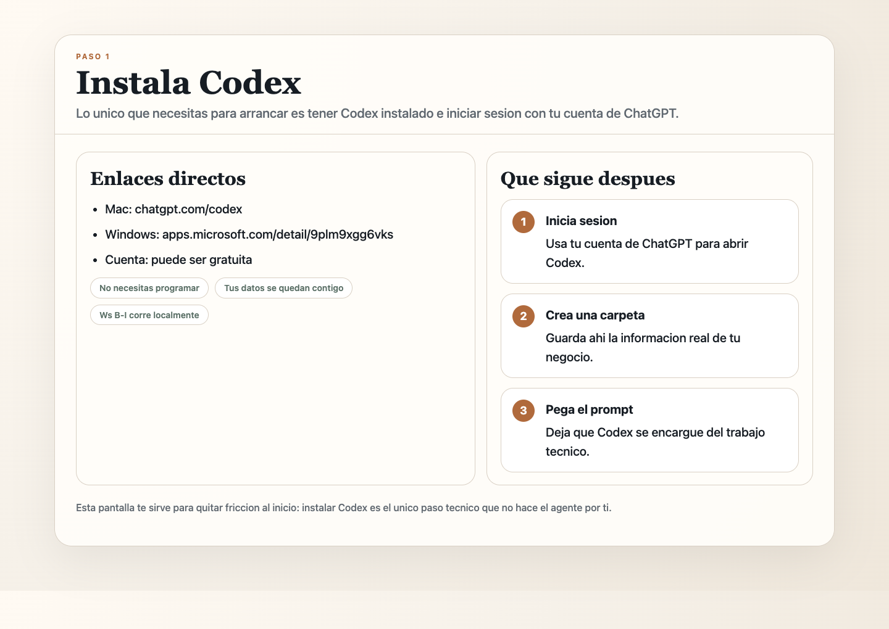
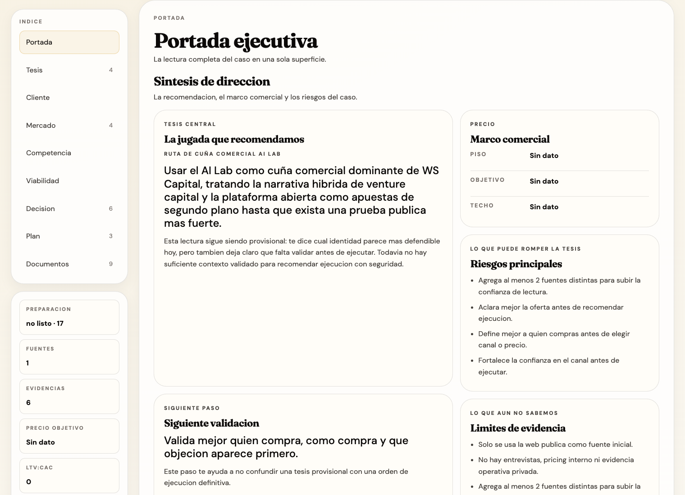
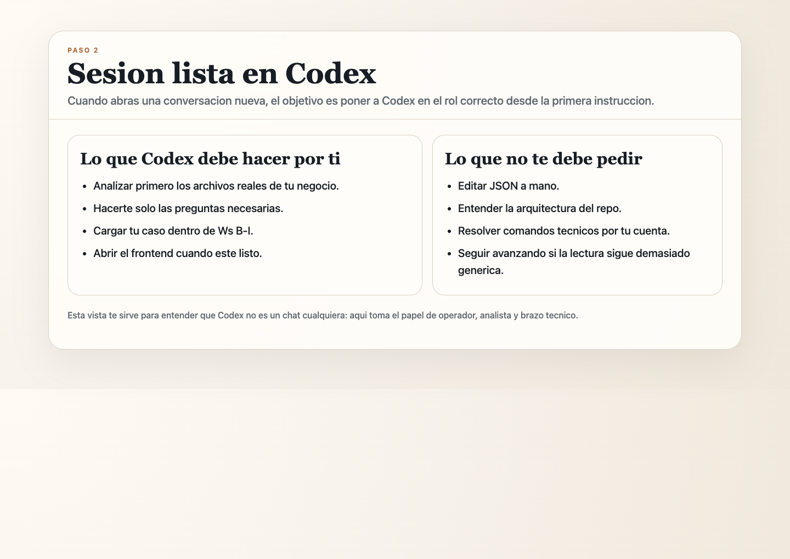
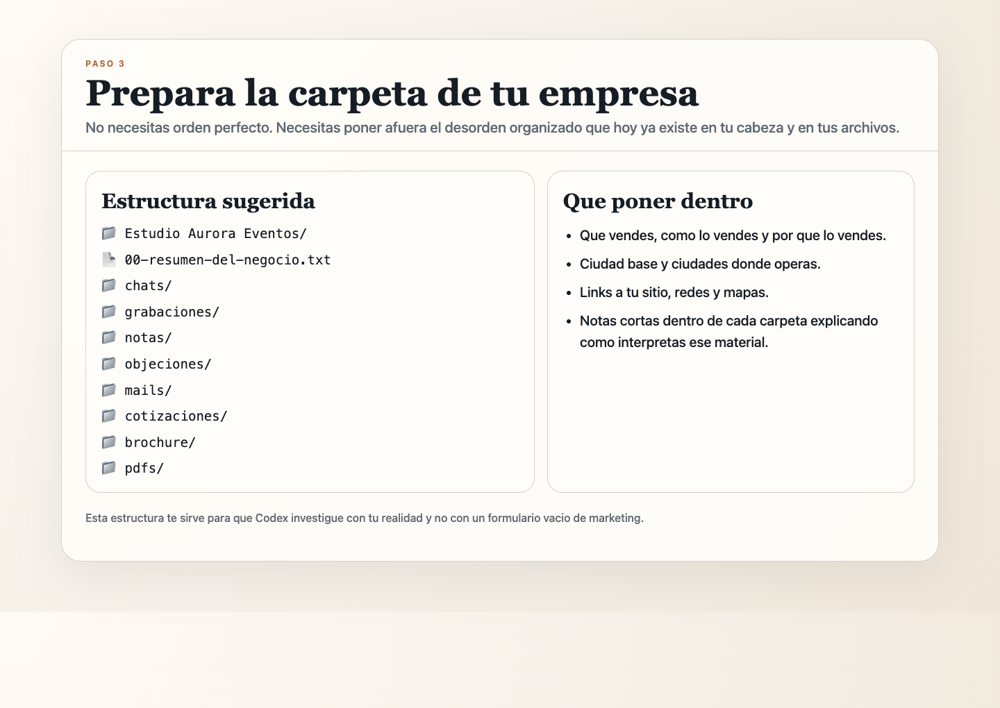
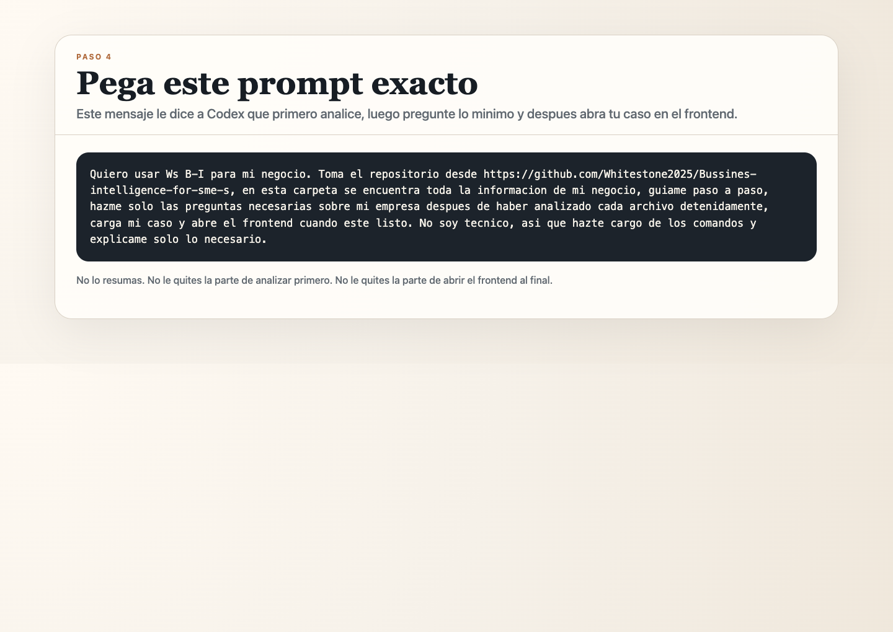
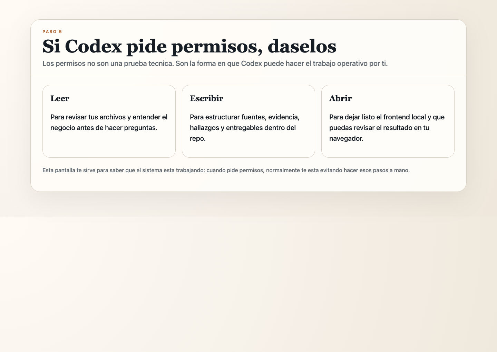
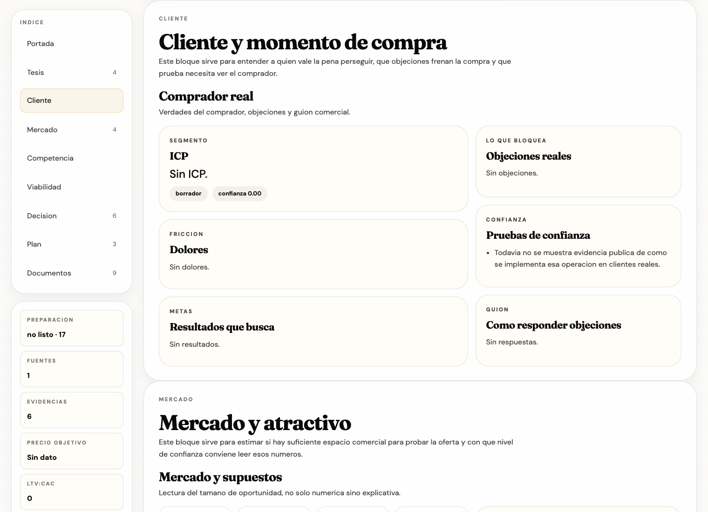
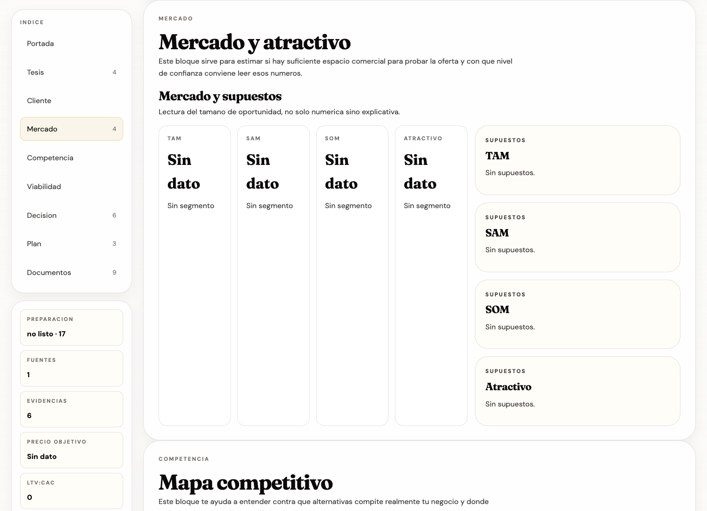
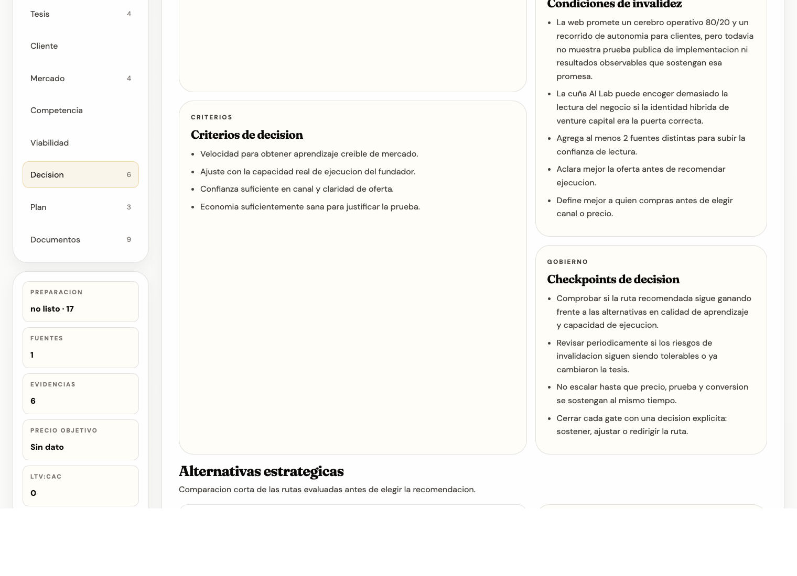
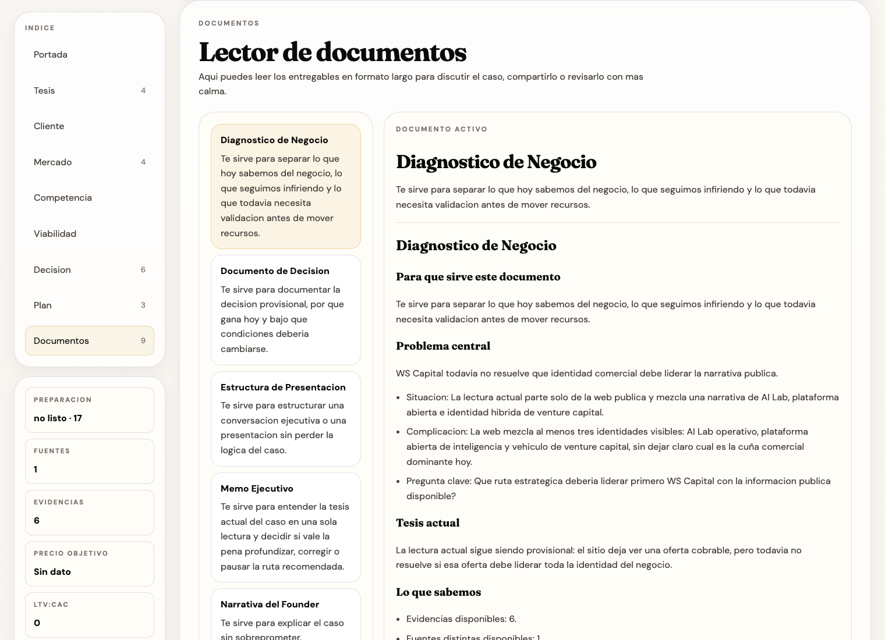

# Guia publica de Ws B-I

## Como convertir el desorden de tu negocio en evidencia, hallazgos y decisiones con Codex

Esta guia esta pensada para founders, duenos de negocio, operadores y solopreneurs que no son tecnicos.

No necesitas aprender a programar.
No necesitas entender la estructura del repo.
No necesitas saber que es un frontend antes de empezar.

Lo que si necesitas es algo mucho mas simple:

- una carpeta con la informacion real de tu negocio,
- ganas de dejar que Codex haga el trabajo pesado,
- y criterio para revisar lo que el sistema te devuelva.



_Esta vista te sirve para ubicarte desde el primer minuto: el sistema no empieza pidiendote marketing perfecto, empieza ayudandote a cargar tu caso._

## 1. De donde sale esta herramienta

Conoci el trabajo de McKinsey & Company en pandemia, asi como el de Boston Consulting Group.

En ese tiempo trabajaba como representante en Latam de una empresa de arbitraje de commodities basada en Espana.
Gracias a esa experiencia me di cuenta de la ventaja gigante que es poder tener informacion asi y poder interpretarla asi se hizo muy obvio por que ciertas empresas podian tomar esas decisiones.

Ahi te cae el veinte de que la brecha en Latam no es falta de talento, ganas o esfuerzo.
La brecha, muchas veces, es falta de conocimiento y estructura.

Eso no significa que en Latinoamerica falte gente capaz.
Significa que muchisimos negocios operan con buena intuicion, experiencia real y datos utiles, pero sin una forma consistente de convertir todo eso en lectura, criterio y decision.

## 2. El momento que lo volvio obvio

Hace unos meses llego a nuestro [AI Lab](https://wsc.lat/) una solopreneur de eventos.

Su negocio estaba en WhatsApp, correos mezclados, notas, tickets, facturas, capturas y audios.
Un desorden.
Pero conocia cada detalle de su negocio.
Tenia datos muy definidos, solo que revueltos.

Cuando vimos eso, entendimos dos cosas:

- ella si sabia que hacer con la informacion;
- nosotros encontramos una mejor manera de pedirla.

De ahi salio [Ws B-I](https://github.com/Whitestone2025/Bussines-intelligence-for-sme-s):
una herramienta de codigo abierto para convertir ese desorden en evidencia, hallazgos, decisiones y un dashboard local revisable en Chrome o en cualquier navegador.

La idea no fue "inventar inteligencia".
La idea fue darle estructura a algo que ya existia en la cabeza y en los materiales del negocio.

## 3. Que hace Ws B-I de verdad

Ws B-I no sirve para darte una respuesta bonita ni para producir un dashboard ornamental.

Sirve para tomar materiales reales de tu negocio, ordenarlos y convertirlos en una lectura que puedas revisar junto con Codex.

En la practica, hace esto:

1. Toma lo que hoy esta disperso en tu negocio.
2. Lo convierte en fuentes y evidencia usable.
3. Detecta lo que parece ser tu oferta real, tu cliente probable, tus riesgos y tus huecos.
4. Separa lo que sabe de lo que todavia sigue siendo hipotesis.
5. Te propone una lectura de negocio y una ruta de accion.
6. Deja todo visible en un frontend local para que lo audites y lo mejores.

Lo importante es esto:

Ws B-I no reemplaza tu criterio.
Lo fortalece.

## 4. Que te entrega y para que sirve cada cosa

Cuando el sistema termina, no solo te deja "archivos".
Te deja una mesa de trabajo para pensar mejor tu negocio.

### Fuentes

Te sirven para revisar de donde salio el analisis.
Si el sistema esta diciendo algo importante, aqui puedes ver si lo saco de una web, de un chat, de una nota o de varias piezas de informacion al mismo tiempo.

### Evidencia

Te sirve para separar hechos de opiniones.
Aqui ves lo que realmente encontro el sistema y con que soporte.

### Hallazgos

Te sirven para ver que patrones detecto.
No son verdades absolutas.
Son lecturas que Codex construye desde tu material para ayudarte a ver cosas que ya estaban ahi pero desordenadas.

### Cliente

Te sirve para entender a quien parece que le vendes de verdad, por que compra, en que duda y que necesita ver para confiar.

### Mercado

Te sirve para revisar si parece haber espacio suficiente para justificar una prueba comercial razonable.
No es magia.
Es una lectura con nivel de confianza y con supuestos visibles.

### Precio y viabilidad

Te sirve para discutir si el rango actual parece defendible y si la economia del caso aguanta una prueba comercial.
No te dicta un precio final.
Te da un punto de partida para pensar con mas estructura.

### Decision

Te sirve para ver cual es la ruta sugerida hoy y por que.
Esta vista deberia ayudarte a evitar el error de confundir una ocurrencia con una decision.

### Plan

Te sirve para bajar la decision a pasos ejecutables.
Si la lectura no puede convertirse en acciones concretas, entonces todavia no esta madura.

### Documentos

Te sirven para leer el caso completo con calma, compartirlo con socios o revisarlo con tu equipo.

### Auditoria

Te sirve para revisar cuanto confiar hoy en esa lectura.
Es la capa que te permite preguntar:

- de donde salio esto,
- cuanta evidencia lo sostiene,
- y que sigue abierto.



_Esta pantalla te sirve para ubicarte rapido: ves el caso activo, el foco actual y el siguiente movimiento sugerido sin tener que leer todo de golpe._

## 5. Que necesitas instalar

Somos un [AI Lab](https://wsc.lat/) y creamos esta herramienta como [open source](https://github.com/Whitestone2025/Bussines-intelligence-for-sme-s).

Eso significa algo importante:

debes instalarla en tu maquina.

Y eso tambien significa algo bueno:

el trabajo queda de tu lado.
Tus datos quedan de tu lado.
Y la herramienta se vuelve tuya.

Lo hicimos lo mas simple posible.
Para arrancar, solo necesitas instalar Codex.

- [Instalar Codex en Mac](https://chatgpt.com/codex)
- [Instalar Codex en Windows](https://apps.microsoft.com/detail/9plm9xgg6vks?hl=es-ES&gl=ES)



_Lo unico que necesitas aqui es iniciar sesion con tu cuenta de ChatGPT. Puede ser gratuita._

## 6. Como preparar la carpeta de tu empresa

Ahora pasaremos a utilizarlo.

Lo unico que tienes que hacer es alimentarlo.

Para eso, crea una nueva carpeta con el nombre de tu empresa y coloca ahi toda la informacion que tengas de tu negocio.

Empieza por un documento de texto que diga:

- el nombre de tu negocio,
- que vendes,
- como lo vendes,
- por que lo vendes,
- en que ciudad estas localizado,
- en que ciudades tienes operaciones,
- la liga a tu sitio web,
- Facebook,
- Google Maps,
- Instagram,
- LinkedIn,
- TikTok,
- y todos los canales sociales que tengas.

Despues separa por carpetas.
Y deja una nota de texto en cada carpeta explicando que contiene y como la interpretas tu.

Por ejemplo:

- chats con clientes,
- conversaciones grabadas,
- notas,
- listado de objeciones,
- mails,
- cotizaciones,
- brochure,
- PDFs,
- testimonios,
- audios,
- capturas,
- cualquier archivo que ayude a entender como funciona tu negocio de verdad.

Piensa en ese desorden organizado que tienes en tu cabeza.
La idea es sacarlo de tu memoria y ponerlo donde el sistema lo pueda leer contigo.



_Esta estructura te sirve para darle contexto a Codex sin obligarte a convertirte en tecnico. No tiene que estar perfecta; tiene que estar viva y entendible para ti._

## 7. El prompt exacto

Este es uno de los pasos mas importantes.

Con esto tus nuevos agentes AI haran la investigacion.
Tu trabajo es abrir una nueva conversacion, asegurarte de estar en la carpeta que creaste y pegar este prompt:

```text
Quiero usar Ws B-I para mi negocio. Toma el repositorio desde https://github.com/Whitestone2025/Bussines-intelligence-for-sme-s, en esta carpeta se encuentra toda la informacion de mi negocio, guiame paso a paso, hazme solo las preguntas necesarias sobre mi empresa despues de haber analizado cada archivo detenidamente, carga mi caso y abre el frontend cuando este listo. No soy tecnico, asi que hazte cargo de los comandos y explicame solo lo necesario.
```

No lo resumas.
No lo expliques mas de la cuenta.
Pegalo tal cual o con cambios minimos si tu caso lo necesita.



_Este prompt te sirve para poner a Codex en el rol correcto desde el inicio: primero analiza, luego pregunta lo minimo, despues carga el caso y al final abre el frontend._

## 8. Que pasa despues de dar Enter

Despues de eso, da Enter.

Si te pide cualquier permiso, daselo.

Te pedira permisos para:

- leer,
- escribir,
- investigar,
- preparar el caso,
- y dejar listo el frontend.

No te esta pidiendo que programes.
Te esta pidiendo permiso para hacer el trabajo tecnico por ti.



_Esta parte te sirve para no asustarte: los permisos son la manera en que Codex puede revisar tus archivos, estructurar tu caso y dejarlo listo en tu navegador._

Cuando termine, abrira una pestana en el navegador.
Y ahi podras entrar a revisar todo el trabajo que hizo tu agente.

## 9. Como leer el frontend sin perderte

Ahora si: es hora de revisar la informacion que tu agente encontro de ti.

En esta guia usamos como ejemplo visual el caso de **WS Capital**, levantado solo desde informacion publica disponible en [wsc.lat](https://wsc.lat/), para mostrarte como se ve el sistema cuando ya hizo su trabajo inicial.

Eso importa por dos razones:

- las capturas no vienen de un caso inventado para verse bonito;
- y al mismo tiempo te recuerdan que una lectura hecha solo desde una web sigue teniendo limites que debes revisar.

### Portada ejecutiva

La portada te sirve para ubicarte rapido.

En una sola vista deberias poder responder:

- cual es el caso activo,
- en que estado esta,
- cual es la lectura actual,
- y que siguiente paso sugiere el sistema.


_Te sirve para entender donde estas parado antes de entrar al detalle._

### Cliente

La vista de cliente te sirve para responder una pregunta sencilla:

quien parece ser el comprador y por que compraria.

Tambien te ayuda a revisar:

- objeciones visibles,
- dolores repetidos,
- resultados buscados,
- y que prueba haria falta para confiar mas en esa lectura.



_Te sirve para evitar mensajes genericos. Si el sistema no puede explicar bien al cliente, tu caso todavia no esta listo para empujar una ruta comercial fuerte._

### Mercado

La vista de mercado te sirve para entender si parece haber suficiente espacio comercial para justificar una prueba.

No solo deberia mostrar numeros.
Tambien deberia mostrar que tan confiables son los supuestos detras de esos numeros.



_Te sirve para pensar con mas contexto y menos intuicion aislada._

### Decision

La vista de decision te sirve para saber cual es la ruta sugerida y por que.

Lo importante aqui no es obedecer ciegamente al sistema.
Lo importante es que puedas revisar:

- que problema cree que estas resolviendo,
- que alternativa recomienda,
- por que gana hoy,
- que la podria invalidar,
- y que hace falta validar antes de ejecutar con mas fuerza.



_Te sirve para discutir estrategia, no solo tareas. Si la salida fuera solo "haz una pagina" o "sube contenido", entonces el sistema estaria pensando mal._

### Documentos

La vista de documentos te sirve para leer el caso con mas calma y compartirlo.

Aqui normalmente encuentras memos, diagnosticos, rutas estrategicas y entregables que condensan lo que el sistema entendio.



_Te sirve para revisar el caso fuera del dashboard rapido y discutirlo con otras personas._

### Auditoria

La auditoria te sirve para revisar cuanto confiar hoy en la lectura.

Es la parte que responde:

- de donde sale esta conclusion,
- cuanta evidencia la soporta,
- y que sigue abierto.


_Te sirve para no tratar una hipotesis como si fuera una verdad solo porque esta bien escrita._

## 10. Aqui no termina, aqui empieza lo mas divertido

Ahora si ya terminamos, o eso creen todos.

En realidad, aqui empieza lo mas divertido.

Ya analizaste lo que hicieron los agentes.
Ahora vuelve a Codex en un lado de tu pantalla y deja tu reporte en el otro.

Pregunta todo lo que te genere duda:

- como lo hizo,
- de donde saco la informacion,
- como razono,
- por que recomendo eso y no otra cosa,
- que evidencia le falto,
- que conclusion sigue siendo debil,
- como mejoraria el caso si tuviera mas material.

De esta manera puedes pedirle que mejore.

Y tambien puedes aprender a razonar como un consultor que cobra 500 dolares la hora, si piensas lo suficiente y te apoyas en lo que ya sabes hacer.

Ese es el verdadero valor de usar bien una herramienta como esta:

no solo sacar una salida,
sino aprender a pensar mejor con ella.

## 11. Si te ayudo, compartelo

Ayudanos a compartirlo si te gusto.

- Danos una estrella en [GitHub](https://github.com/Whitestone2025/Bussines-intelligence-for-sme-s)
- Queremos saber que aprendiste
- Nos encantaria saber si tienes alguna idea para mejorarlo
- Y tambien si lo mejoraste e hiciste tu propia version
- [Nos encantaria saber como te ayudo](https://wsc.lat/)

Usemos lo que ya tenemos para ayudarnos a mejorar.
